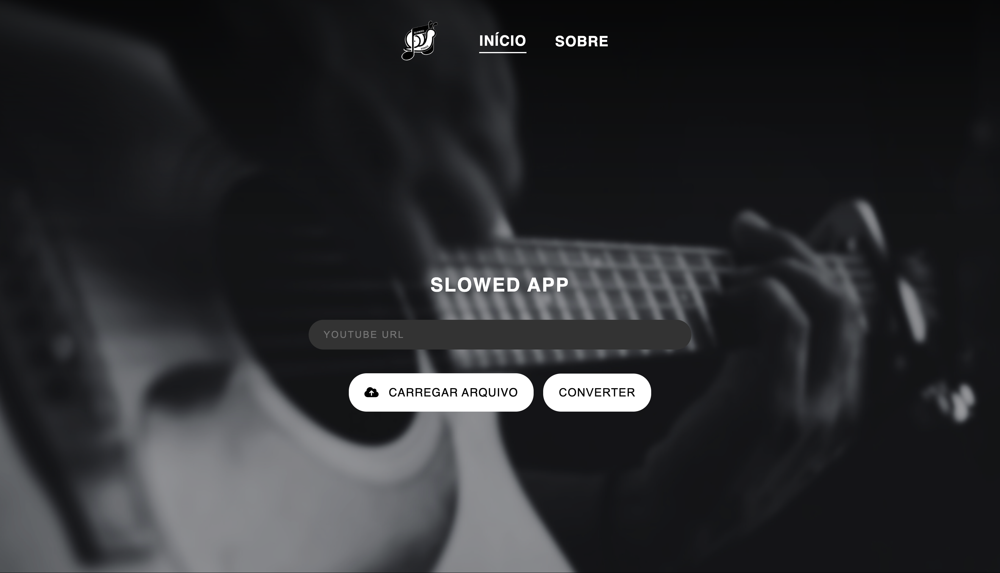
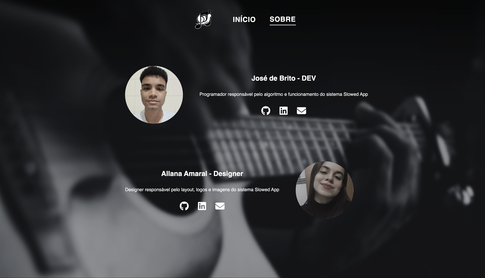

# Welcome to Slowed App
## Make your songs Slowed + Reverb easily




## Send your song by youtube url or select a song file

## Usage:

#### Create a virtualenv and run below commands:

```bash
    source bin/activate
    
    git clone https://github.com/josephbrito/Slowed-app

    pip install -r requirements.txt

    python index.py
```

### Techs:
- Python3
- Flask
- Pytube
- Pydub
- AudioFusion
- Pedalboard
- JQuery

### Todo:
* [ ] User controls level of slowed and reverb
